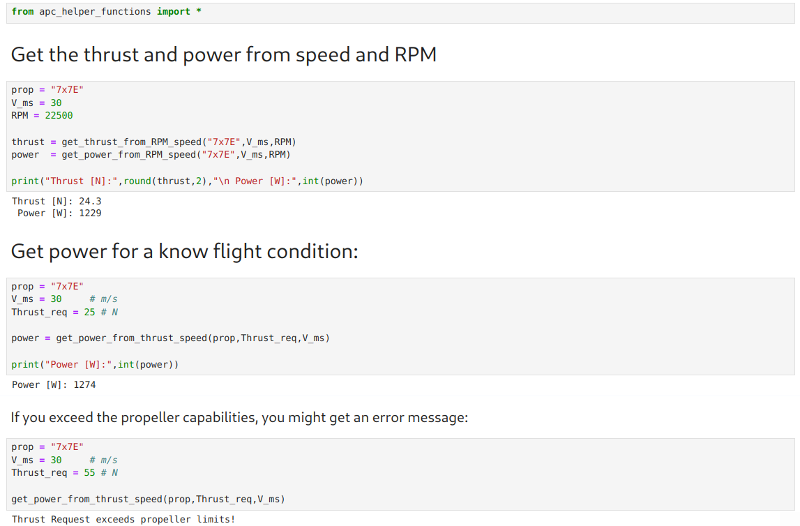
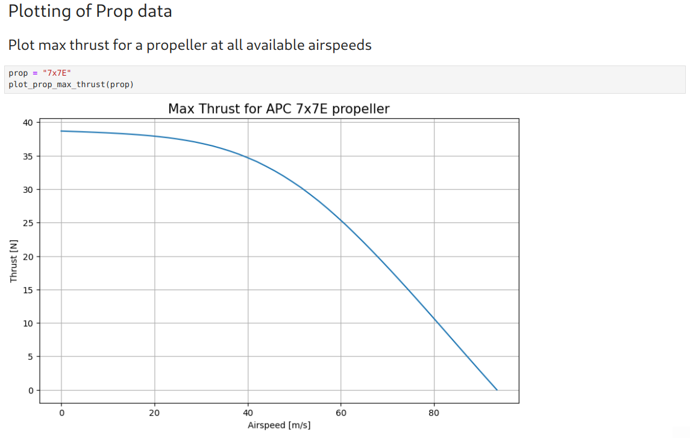
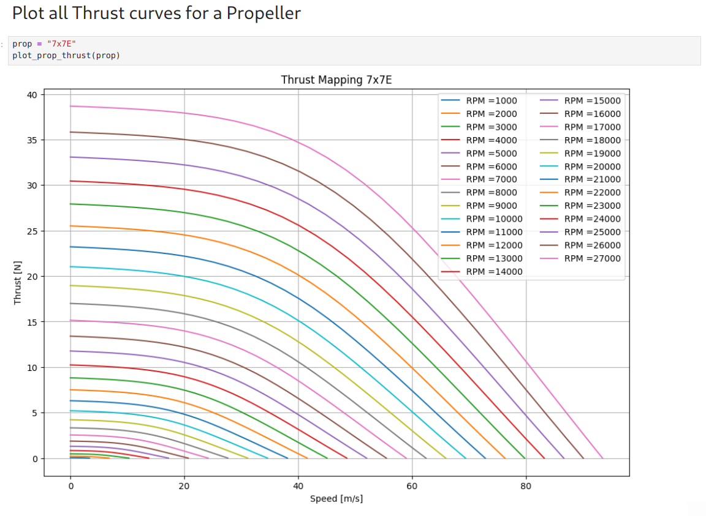
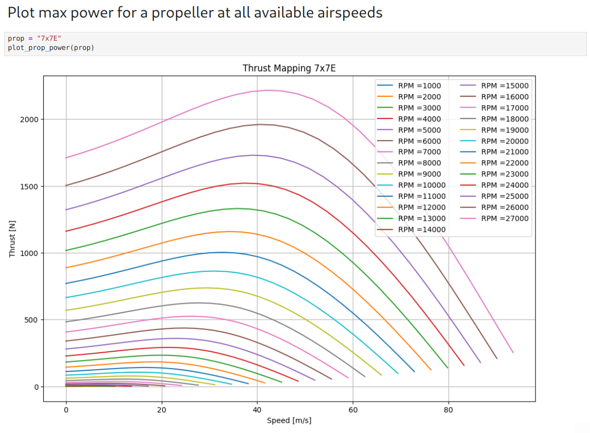

# APC Prop Helper Project

## 1. What is the purpose of this project

The company [APC](https://www.apcprop.com) is a manufacturer of model aircraft propellers. These propellers are often used for RC-Planes and drones.

APC also offers [performance data](https://www.apcprop.com/technical-information/performance-data/) for their products.

These performance DAT files show the prop thrust, power, torque and other data sorted by RPM and airspeed.

This is a very valuable data source for aircraft design, as APC has A LOT of propellers.

The data is ordered by RPM and airspeed.

Unfortunately, thes are only discrete data points.
e.g.: The data will show you the thrust of a prop at 26000RPM at 32.74mph, or at 34.74mph at 9000 RPM.

For aplications like aircraft performance optimisation this data is not usable in its current state.

To follow up the example:
If I want to fly my mission at 33mph, I don't know the exact thrust of power of this propeller.

For an numerical optimzier this is a "breaking" scenario, as  these functions need a contious and smooth function to work.

# 2.  Main Idea behind this project

#### - Provide a Database (CSV or Pandas-dataframe) for easy prop performance search (e.g. what prop provides x N of thrust and y m/s airspeed)
#### - Provide functions to predict the thrust and power for each propeller within its published flight envelope (get thrust and power from speed and RPM)  
#### - Provide functions to get the RPM or power for a given design task (get power & RPM from thrust)
#### - Provide basic plotting functions for prop data

## 3. How to use it

This repository already contains all the interpolator files for all props available at end of 2024.

#### Units:
speeds --> m/s  
RPM --> 1/min  
Thrust --> N  
Power --> W  

If you want to use the available propeller interpolator files, see the example section of how to use it:

## 4. How to build your own interpolator files

If APC adds more propellers to their website that are not covered by this project, the workbooks to convert the DAT files into a database is provided, as well as a workbook to create interpolator files from this database.

## Examples  

